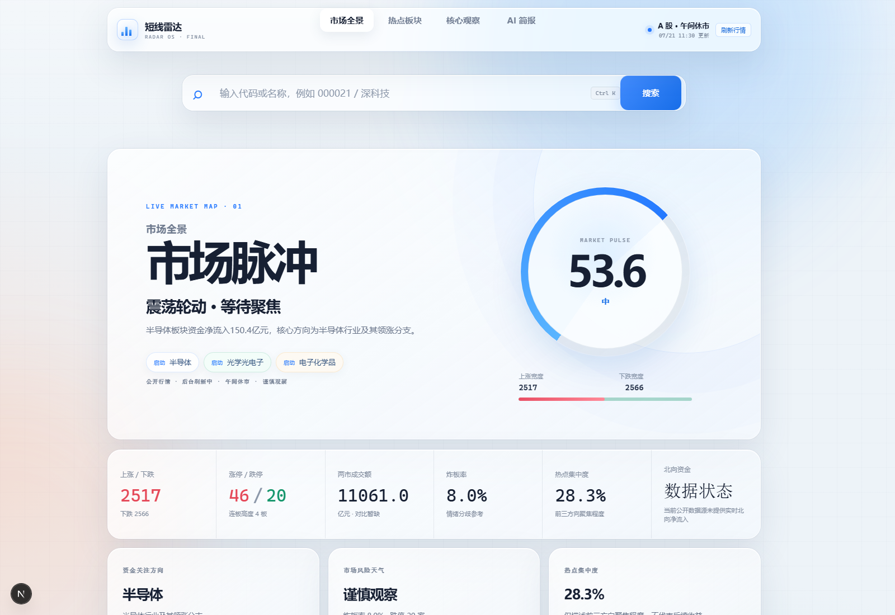
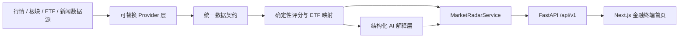

# AI 短线市场雷达

面向中国 A 股短线投资者的市场研究辅助工具。产品回答“当前市场的钱在哪里、热点处于什么阶段、有哪些对应 ETF 研究工具”，不提供买卖建议，不预测涨停，不连接券商。

当前仓库实现的是可运行版本：公开 A 股行情接入、确定性市场评分、20 个交易日板块轮动、新闻催化证据、技术信号统计、结构化 LLM 解读、统一搜索、FastAPI 接口和中文研究终端。



## 当前能力

- 市场情绪：强 / 中 / 弱及 0–100 分评分；
- 涨跌家数、涨跌停、连板高度、炸板率、成交额、热点集中度；
- 三大热点板块、热度、阶段、核心方向、催化和风险；
- 前 20 个交易日板块涨跌幅、成交额、量能、5 日 / 20 日趋势与相对强度；
- 板块分类口径、轮动快照、公开价格历史和新闻催化证据；
- 相关 ETF 研究工具及公开基金资料核对；
- 热点代表股、K 线、MACD、KDJ 与周 K 异动统计；
- 股票、板块、ETF 名称或代码统一搜索，A 股代码表启动时后台预热并持久缓存；
- 每日结构化市场简报与 OpenAI-compatible LLM 解读；
- 可选多智能体研判：技术、情绪、新闻、基本面独立研究，多空辩论与风险复核；
- AKShare 公开行情与离线演示 Provider 解耦；
- 60 秒行情快照缓存、股票目录持久缓存、来源时间、交易状态和上游异常提示；
- 上游失败时返回 `503`，不会静默回退成演示数据。

默认使用 `backend/app/providers/akshare_live.py`。页面会明确显示“公开行情”、数据时间和来源。`backend/app/providers/demo.py` 仅供离线测试，只有显式设置 `MARKET_DATA_PROVIDER=demo` 才会启用。

## 架构



核心原则：**数值由代码计算，AI 只解释结构化事实**。LLM 无法改写评分、编造来源或输出交易指令。

### AI 模型连接与结果格式

- 在“AI简报”页面打开“模型设置”，填写 OpenAI-compatible API Key、模型 ID 与 API 地址；
- “保存并测试”会发起一次最小 Chat Completions 请求，分别提示 Key 无效、模型不可用、接口地址错误、权限/额度限制或连接成功；
- API Key 仅保存在本机 `.runtime/config/llm-config.json`，状态接口与前端响应不会返回 Key；
- AI 结果固定整理为“市场结论、核心证据、风险、数据缺口”四块，页面不再直接渲染模型返回的 Markdown；
- 如果模型返回的 JSON 结构不合格，本次分析会明确失败，不会把无法验证的原始文本包装成结果。

### 可选：多智能体研判

```powershell
powershell -ExecutionPolicy Bypass -File .\scripts\install-trading-agents.ps1
```

安装后重启 Agu，在导航栏打开“多智能体研判”。该页面复用“AI 简报”中的本机模型配置，分别展示技术、情绪、新闻、基本面报告，以及多空辩论和风险复核。它使用独立外部数据链，不连接券商，不执行订单。详细边界见 [`docs/MULTI_AGENT_RESEARCH.md`](docs/MULTI_AGENT_RESEARCH.md)。

## 技术栈

- Frontend：Next.js 16、React 19、TypeScript、Vitest
- Backend：Python 3.12、FastAPI、Pydantic、Pytest、Ruff
- MVP 数据：AKShare 聚合的同花顺行业行情、东方财富涨跌停股池、ETF 实时行情
- 正式数据目标：PostgreSQL + TimescaleDB（技术设计见 `docs/AI短线市场雷达-产品设计方案.md`）

## 快速开始（Windows PowerShell）

### 最简单：双击启动

依赖安装完成后，直接双击项目根目录中的：

`启动AI短线市场雷达.cmd`

脚本会自动：

1. 直接从 `8001` 和 `3000` 开始检测，不会尝试 `8000`；
2. 如果端口被占用，则向后寻找可用端口；
3. 启动 FastAPI 和 Next.js；
4. 等待服务就绪；
5. 使用默认浏览器打开首页。

启动窗口需要保持打开，按 `Ctrl+C` 可停止本次启动的服务。诊断日志位于 `.runtime\logs`。

### 1. 安装依赖

```powershell
Set-Location <Agu 项目目录>
powershell -ExecutionPolicy Bypass -File .\scripts\bootstrap.ps1
```

### 2. 启动前后端

```powershell
powershell -ExecutionPolicy Bypass -File .\scripts\dev.ps1
```

打开：

- Web：http://127.0.0.1:3000
- API 文档：http://127.0.0.1:8001/docs
- 健康检查：http://127.0.0.1:8001/api/v1/health

按 `Ctrl+C` 会停止本次脚本启动的前后端进程。若默认端口被占用，控制台会显示实际选择的地址。

### 3. 全量验证

```powershell
powershell -ExecutionPolicy Bypass -File .\scripts\verify.ps1
```

验证链包括：后端 Pytest、Ruff、前端 Vitest、ESLint、Next.js 生产构建。

## 主要 API

| Method | Path | 用途 |
| --- | --- | --- |
| GET | `/api/v1/health` | 健康检查 |
| GET | `/api/v1/market/overview` | 首页市场总览 |
| GET | `/api/v1/sectors/hot` | 热点板块排序 |
| GET | `/api/v1/sectors/{sector_id}` | 板块详情 |
| GET | `/api/v1/search?q=深科技` | 股票 / 板块 / ETF 搜索 |
| GET | `/api/v1/trading-agents/status` | 多智能体组件与模型状态 |
| POST | `/api/v1/trading-agents/runs` | 创建多智能体研究任务 |
| GET | `/api/v1/trading-agents/runs/{job_id}` | 查询研究任务与结果 |

## 实时数据口径

- 行业涨跌幅、成交额、资金净流入和涨跌家数：同花顺行业一览；
- 涨停、跌停、炸板、连板高度和昨日涨停表现：东方财富股池；
- ETF 名称、代码、成交额和数据时间：东方财富 ETF 行情；
- 股票代码与名称：沪深北交易所公开证券列表；
- 热点与情绪分值：由上述结构化数据按确定性规则计算，LLM 不参与改写数值；
- ETF 仅在名称或已维护别名精确匹配时展示；没有可靠匹配则明确显示暂无结果；
- 当前公开源没有稳定提供的指标（例如成交额较前日变化、实时北向净流入）会显示“数据源暂缺”，不会填造数值。

公开页面可能限流，因此第一次行情加载可能需要数秒；成功后 60 秒内复用行情快照。完整 A 股代码表会在后台预热并写入 `.runtime/cache/a-share-stock-catalog.json`，后续启动可直接使用本地目录搜索，同时在后台刷新。首次目录尚未就绪时会快速提示初始化状态，不再让搜索请求长时间卡住。上游不可用时 API 返回 `503` 并显示实际错误，不会用演示快照冒充当日数据。

## 产品边界

- 不荐股，不预测涨停；
- 不输出买入、卖出、仓位、目标价或止损位；
- 不承诺收益；
- 不做自动交易或券商连接；
- 所有输出均为投资研究辅助信息。

## 支持项目

如果这个项目对你有帮助，可以请作者喝杯咖啡。感谢你的支持。

<table>
  <tr>
    <th align="center">微信支付</th>
    <th align="center">支付宝</th>
  </tr>
  <tr>
    <td align="center"></td>
    <td align="center"></td>
  </tr>
</table>
