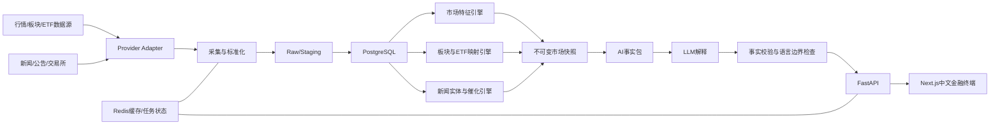

# 《AI短线市场雷达》产品设计方案

> 文档日期：2026-07-17  
> 状态：待确认，确认后再开始编码

## 一、GitHub开源项目调研结论

### 1. 重点参考项目

| 项目 | 调研时Star | 主要借鉴点 | 不直接采用的部分 |
|---|---:|---|---|
| [TradingAgents](https://github.com/TauricResearch/TradingAgents) | 93.4k | 结构化多智能体、数据契约、检查点恢复 | 买卖决策和交易执行 |
| [OpenBB](https://github.com/OpenBB-finance/OpenBB) | 70.7k | 可插拔数据Provider、“接入一次、多处消费” | 海外市场优先的数据语义 |
| [daily_stock_analysis](https://github.com/ZhuLinsen/daily_stock_analysis) | 57.6k | A/H/美股和ETF、多源行情、新闻、Web工作台、定时简报 | 买卖点位和决策式输出 |
| [Qlib](https://github.com/microsoft/qlib) | 46.3k | 数据集、特征、模型和研究流程标准化 | 第一版不需要完整量化研究平台 |
| [VeighNa](https://github.com/vnpy/vnpy) | 43.1k | 国内量化系统的模块化设计 | 自动交易超出产品范围 |
| [TradingAgents-CN](https://github.com/hsliuping/TradingAgents-CN) | 30.3k | 中文体验、A股数据降级、实时任务进度 | 前后端部分存在专有商业许可 |
| [AKShare](https://github.com/akfamily/akshare) | 21.4k | 中国市场数据接口覆盖 | 接口稳定性和生产授权需单独解决 |
| [FinRobot](https://github.com/AI4Finance-Foundation/FinRobot) | 7.6k | 确定性计算与LLM叙述分离、证据溯源 | 偏美股基本面和估值 |
| [RQAlpha](https://github.com/ricequant/rqalpha) | 约6.5k | 可替换数据源和Mod Hook | 回测、模拟交易不进入MVP |
| [tickflow-stock-panel](https://github.com/shy3130/tickflow-stock-panel) | 2.2k | A股概念/行业轮动、连板梯队、React/FastAPI/Polars | 回测和盯盘不是首版重点 |
| [aiagents-stock](https://github.com/oficcejo/aiagents-stock) | 1.7k | 板块轮动、资金方向、龙虎榜表达 | 荐股、预测和自动交易方向 |

### 2. 综合结论

不存在一个可以直接复制的完整项目。推荐组合为：

```text
OpenBB 的 Provider 抽象
+ AKShare/Tushare/TickFlow 的 A 股数据能力
+ tickflow-stock-panel 的板块与连板表达
+ daily_stock_analysis 的中文工作台与定时简报
+ FinRobot 的确定性计算和证据溯源
+ TradingAgents 的结构化 AI 工作流
```

真正的产品差异应当是：

> A股短线资金方向解释 + 板块阶段识别 + 可解释的主题—ETF映射。

### 3. 不适合本产品的开源设计

- `BUY/SELL/HOLD` 输出；
- 涨停、目标价和收益预测；
- 自动下单和券商连接；
- 直接使用美股舆情指标解释A股；
- LLM直接读取原始行情并自行计算数字；
- 用单一分类源代替统一板块本体；
- 把非官方估算包装成实时北向净流入。

自2024年8月19日起，沪深股通不再公开盘中实时买入、卖出和净额数据。产品只能按官方口径展示盘后成交总额、总笔数、ETF成交额、活跃证券和季度持仓等可得信息。

---

## 二、产品PRD

### 1. 产品定位

帮助A股短线投资者在十秒内回答：

1. 今天市场强还是弱？
2. 资金主要集中在哪里？
3. 热点板块处于什么阶段？
4. 对应哪些ETF研究工具？
5. 当前主要风险是什么？

### 2. 首页结构

```text
全局搜索：股票 / 板块 / ETF / 自然语言主题
↓
市场情绪卡
↓
今日三大资金方向
↓
热点板块阶段矩阵
↓
板块对应ETF
↓
核心股票观察
↓
AI市场总结
↓
数据更新时间、来源和质量
```

### 3. 市场情绪分数

| 因子 | 权重 |
|---|---:|
| 上涨/下跌家数广度 | 15% |
| 涨停与跌停数量 | 15% |
| 连板高度及晋级率 | 15% |
| 炸板率 | 15% |
| 全市场成交额变化 | 15% |
| 龙头股强度 | 10% |
| 热点集中度 | 10% |
| 指数与个股中位数表现 | 5% |

分级：

- 70—100：强；
- 45—69：中；
- 0—44：弱。

### 4. 板块热度分数

| 因子 | 权重 |
|---|---:|
| 板块涨幅和上涨宽度 | 20% |
| 成交额增速 | 20% |
| 相对市场强度 | 15% |
| 涨停密度 | 15% |
| 龙头表现 | 10% |
| 可获得资金流数据 | 10% |
| 新闻催化强度 | 10% |

板块阶段使用确定性状态机：

```text
冷却 → 启动 → 上涨 → 高潮 → 分歧 → 退潮
```

采用连续快照确认和滞后阈值，避免频繁跳变。

### 5. 主题—ETF映射

自然语言查询先映射到标准主题，再连接到指数和ETF：

```text
用户表达
→ 主题别名
→ 标准主题
→ 行业/概念/产业链
→ 指数
→ ETF
→ 成分覆盖解释
```

相关度建议：

```text
35% 成分股重合度
+ 25% 指数编制主题匹配
+ 15% 产业链方向匹配
+ 10% 名称与别名匹配
+ 10% 数据新鲜度
+ 5% 人工审核状态
```

ETF规模、成交额、费用和跟踪误差只作为客观资料展示，不生成购买排序。

### 6. AI输出契约

每条AI结论必须包含：

```json
{
  "as_of": "数据截止时间",
  "summary": "事实性总结",
  "evidence_ids": ["证据ID"],
  "confidence": "high|medium|low",
  "data_quality": "complete|partial|stale",
  "risk_factors": [],
  "missing_data": []
}
```

---

## 三、技术架构

### 1. 推荐架构

采用模块化单体：

- Next.js + TypeScript；
- FastAPI；
- PostgreSQL；
- Redis；
- 独立数据Worker；
- 可替换LLM Provider；
- Docker Compose。

暂不拆分微服务，避免第一版承担不必要的部署和一致性成本。

### 2. 系统结构



### 3. Provider接口

```text
MarketDataProvider
SectorDataProvider
ETFDataProvider
FundFlowProvider
NewsProvider
AnnouncementProvider
```

每个Provider必须声明：

- 支持市场和频率；
- 字段映射；
- 授权范围；
- 限流；
- 优先级；
- 降级条件；
- 健康状态；
- 数据截止时间。

### 4. 核心数据表

- `instruments`
- `trading_calendars`
- `quotes_daily`
- `quotes_intraday`
- `market_snapshots`
- `limit_events`
- `sectors`
- `sector_aliases`
- `sector_memberships`
- `sector_snapshots`
- `capital_flows`
- `etf_profiles`
- `etf_constituents`
- `theme_etf_mappings`
- `news_documents`
- `news_entity_links`
- `analysis_runs`
- `ai_briefs`
- `data_lineage`
- `provider_health`

### 5. 主要API

```text
GET  /v1/market/overview
GET  /v1/market/sentiment/history
GET  /v1/sectors/hot
GET  /v1/sectors/{sector_id}
GET  /v1/sectors/{sector_id}/stocks
GET  /v1/sectors/{sector_id}/etfs
GET  /v1/stocks/{code}
GET  /v1/etfs/{code}
GET  /v1/search?q=
GET  /v1/briefs/daily
POST /v1/assistant/query
GET  /v1/analysis-runs/{run_id}
GET  /v1/data-status
```

### 6. AI分析链

```text
用户问题
→ 意图分类
→ 实体解析
→ 查询结构化事实
→ 构建只读事实包
→ LLM按Schema生成解释
→ 数字逐项回查
→ 证据覆盖率检查
→ 荐股语言检查
→ 发布
```

---

## 四、MVP开发计划

### 1. P0范围

- 首页市场情绪；
- 三大热点板块；
- 板块阶段；
- 板块对应ETF；
- 核心股票观察；
- 股票/板块/ETF搜索；
- 每日AI市场简报；
- 数据来源和更新时间；
- 数据源健康状态。

### 2. 暂不开发

- 账户、持仓和自选组合；
- 自动交易；
- 回测；
- 选股器；
- 实时预警；
- 社区；
- 复杂多智能体；
- 个性化投资建议；
- 移动App。

### 3. 六周计划

#### 第1周：数据和规则

- 确认数据授权；
- 固化Provider协议；
- 建立证券、板块、ETF基础表；
- 固化市场情绪和板块热度公式；
- 建立ETF映射人工基准集。

#### 第2周：数据管道

- 行情、板块、ETF、新闻接入；
- 标准化、质量检查、降级和重试；
- 盘后调度。

#### 第3周：计算引擎

- 市场情绪；
- 热点排序；
- 板块阶段状态机；
- 个股相对板块强度；
- 主题—ETF映射。

#### 第4周：后端与AI

- FastAPI；
- 搜索；
- 每日快照；
- AI事实包；
- 结构化生成；
- 事实和语言边界检查。

#### 第5周：前端

- 首页；
- 板块详情；
- 股票详情；
- ETF关联卡；
- 简报和数据健康提示；
- 深色主题。

#### 第6周：验证

- 历史交易日回放；
- ETF映射人工评测；
- AI事实一致性测试；
- 数据源故障演练；
- 性能和部署验证。

### 4. 验收标准

- 核心行情完整率不低于99%；
- 数据任务成功率不低于99%；
- ETF Top-3映射人工审核准确率不低于85%；
- AI重要结论证据覆盖率100%；
- 所有数字可回查数据库；
- 不生成买卖、仓位、收益承诺；
- 首页缓存命中时P95响应低于2秒；
- 用户十秒内看到市场状态和三大主线。

## 五、确认门

确认以下内容后再进入代码实施：

1. 第一版以盘后市场雷达为主；
2. 采用Next.js + FastAPI + PostgreSQL + Redis；
3. 采用模块化单体；
4. 把主题—ETF映射作为核心差异；
5. 不开发交易、回测和荐股能力。

